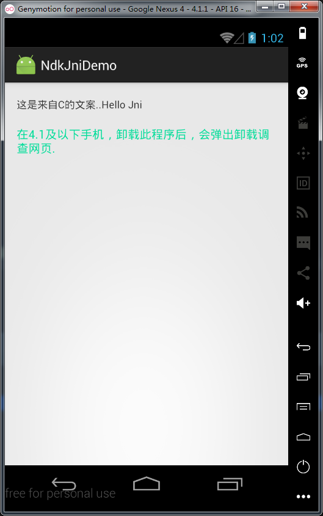

# JniDemo

Jni实例练习，详细配置见：<http://xyzlf.github.io/2016/07/17/android-jni.html>

这个Demo包括展示来着Jni的文案，以及增加了卸载监听。在4.1及以下系统，卸载该App后，会弹出网页。这个网址可以改成卸载调查之类的网址~

# 效果

# License

    Copyright (C)  LessCode Open Source Project
    
    Licensed under the Apache License, Version 2.0 (the "License");
    you may not use this file except in compliance with the License.
    You may obtain a copy of the License at
    
    http://www.apache.org/licenses/LICENSE-2.0
    
    Unless required by applicable law or agreed to in writing, software
    distributed under the License is distributed on an "AS IS" BASIS,
    WITHOUT WARRANTIES OR CONDITIONS OF ANY KIND, either express or implied.
    See the License for the specific language governing permissions and
    limitations under the License.